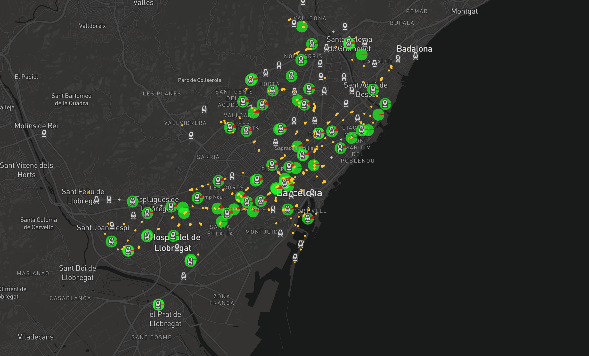

IaaC | MaCT - ALGORITHM ARBITRAGE
===========================
MASTER =  tweers-mact-strikes
search_topics = ["#metrobcn", "#busbcn", "#VagaMetro", "VagaMetro", "metrobcn", "busbcn", "@TMBinfo", "barcelona", "@AdadColau"]
search_topics = ["#TransportPublic", "#Catalonia", "#FreeToThom", "#NoSurrender", "#CataloniaRepublic",
                     "#Makeamove", "#WakeUpEurope", "bcitnews", "#freedomcatalonia", "#TMB_Barcelona",
                     "#metrobarcelona", "#ConstrumatBCN"]

